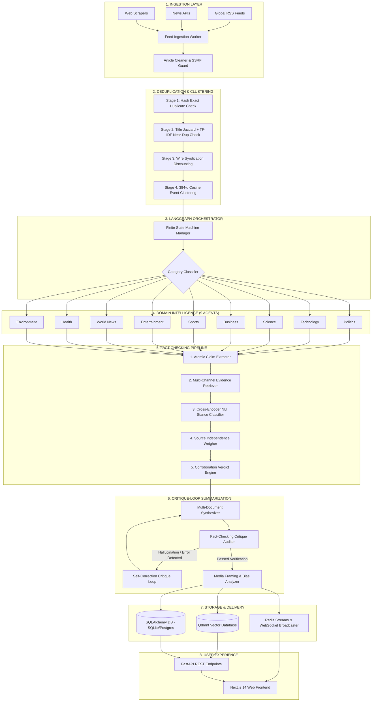
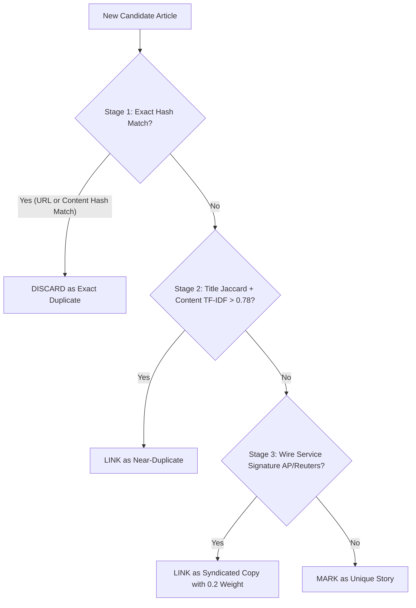
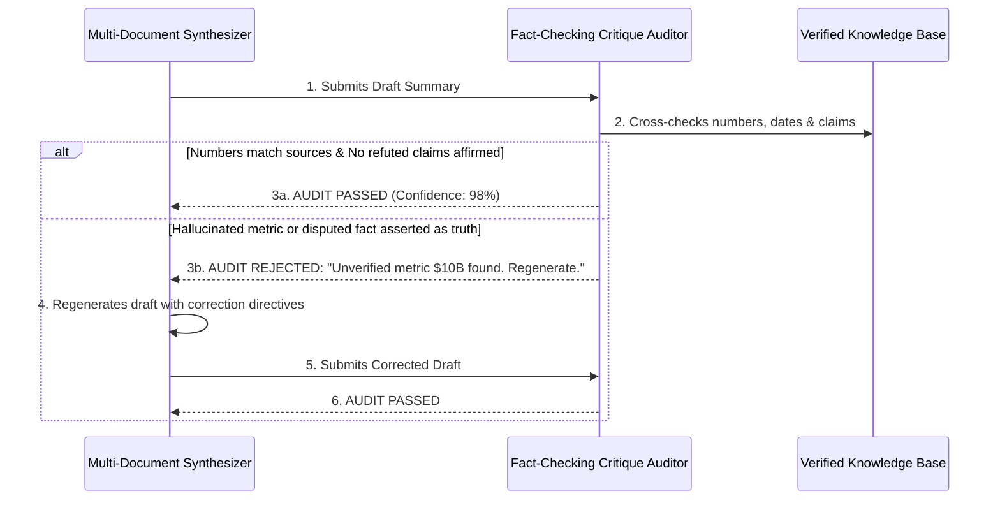
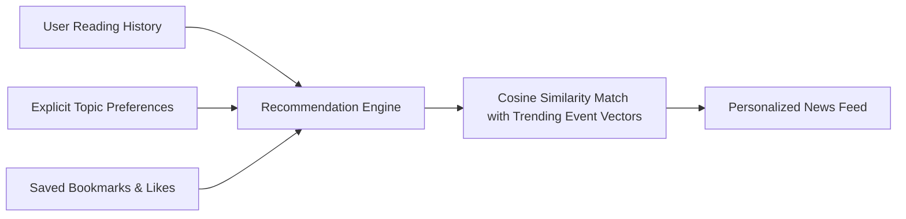

# 🌍 NewsSense AI (SmartFeed AI)
> **An Intelligent Multi-Source News Aggregator, Event Synthesizer & Automated Fact-Checking Platform**

---

## 📖 Table of Contents
1. [What is NewsSense AI?](#1-what-is-newssense-ai)
2. [The Big Problem It Solves](#2-the-big-problem-it-solves)
3. [Main Features at a Glance](#3-main-features-at-a-glance)
4. [Complete System Architecture & Workflow](#4-complete-system-architecture--workflow)
5. [The Agent Team (What Each AI Agent Does)](#5-the-agent-team-what-each-ai-agent-does)
   - [Orchestrator Agent](#-1-orchestrator-agent)
   - [Ingestion Agent](#-2-ingestion-agent)
   - [Deduplication & Clustering Agent](#-3-deduplication--clustering-agent)
   - [Domain Expert Agents (9 Domains)](#-4-domain-expert-agents-9-domains)
   - [Summarizer Agent (with Critique Loop)](#-5-multi-document-summarizer-agent)
   - [Fact-Checking & Verification Agent](#-6-fact-checking--verification-agent)
   - [Bias & Media Framing Analyzer](#-7-bias--media-framing-analyzer)
   - [Vector Store & Semantic Memory](#-8-vector-store--semantic-memory-agent)
   - [API & User Interface (UI)](#-9-api--user-interface-layer)
6. [How Data Moves: News Source ➡️ Final User](#6-how-data-moves-news-source-️-final-user)
7. [How Duplicate News is Detected (No More Copy-Paste Clones)](#7-how-duplicate-news-is-detected)
8. [How Multiple Articles Become One Single Event Cluster](#8-how-multiple-articles-become-one-single-event-cluster)
9. [How AI Summaries are Generated](#9-how-ai-summaries-are-generated)
10. [How Fact-Checking Works (The 5-Stage Verification Chain)](#10-how-fact-checking-works-the-5-stage-chain)
11. [How Source Comparison & Bias Analysis Works](#11-how-source-comparison--bias-analysis-works)
12. [How Embeddings, Vector Search & RAG Work](#12-how-embeddings-vector-search--rag-work)
13. [How Personalization & Recommendations Work](#13-how-personalization--recommendations-work)
14. [Database & Data Storage](#14-database--data-storage)
15. [Real-Time Processing (WebSockets & Queues)](#15-real-time-processing)
16. [APIs and Frontend Overview](#16-apis-and-frontend-overview)
17. [Security & Error Handling](#17-security--error-handling)
18. [Complete Technology Stack](#18-complete-technology-stack)
19. [How to Set Up & Run the Project](#19-how-to-set-up--run-the-project)
20. [Project Directory Structure](#20-project-directory-structure)
21. [End-to-End Walkthrough Example (Step-by-Step)](#21-end-to-end-walkthrough-example)
22. [Current Implementation Status of Every Component](#22-current-implementation-status-of-every-component)

---

## 1. What is NewsSense AI?

Imagine having a super-smart digital research assistant who reads thousands of news articles from newspapers all over the world every single minute. 

Instead of showing you 50 repetitive copies of the exact same story with screaming headlines, **NewsSense AI**:
1. Groups those 50 articles into **one unified story event**.
2. Checks whether the facts and numbers mentioned are **actually true or disputed**.
3. Points out which newspaper has a **political or commercial bias**.
4. Gives you a **short, crystal-clear 1-minute summary** with zero fake facts.
5. Lets you **chat with the news** to ask questions and get grounded answers.

---

## 2. The Big Problem It Solves

When you try reading news on the internet today, you face 4 big problems:

| Problem | What Happens Today | How NewsSense AI Solves It |
| :--- | :--- | :--- |
| **1. Information Overload** | 100 newspapers publish the exact same news using wire copies (AP, Reuters). Your feed is filled with 100 duplicate posts. | Merges all duplicates into a single event card. |
| **2. Fake News & Hallucinations** | Rumors, unverified numbers, and fake statements spread rapidly without anyone checking them. | An automated 5-stage fact-checker verifies claims against independent databases and official sources. |
| **3. Media Bias & Echo Chambers** | Different channels slant the same story to fit their political views, omitting critical facts. | A Media Framing Analyzer shows side-by-side comparisons of how different outlets frame the story. |
| **4. Long, Boring Articles** | Articles have 2,000 words of fluff when only 3 sentences matter. | Multi-Document Summarizer generates instant Flash (45 words) or Standard (120 words) summaries. |

---

## 3. Main Features at a Glance

* ⚡ **Live Multi-Source Ingestion**: Automatic polling from global RSS feeds, NewsAPIs, and custom scrapers.
* 🔍 **Multi-Stage Deduplication**: Catches exact copies, rephrased articles, and syndicated wire copies.
* 📦 **Dynamic Event Clustering**: Automatically groups 10+ related articles into a single evolving story.
* 🛡️ **5-Stage Fact-Checking Engine**: Breaks down articles into atomic claims, retrieves proof, checks logical stances, and awards a verified truth verdict (`WELL_SUPPORTED`, `DISPUTED`, `UNVERIFIED`, `CONTRADICTED`).
* ⚖️ **Source Independence Weighting**: If 10 newspapers copy the same single AP wire story, NewsSense AI counts it as **1 source**, not 10!
* 📝 **Critique-Audited Summaries**: A built-in fact auditor re-checks AI summaries before publishing. If a number was hallucinated, it rejects the draft and forces the AI to correct it.
* 🌐 **Media Bias & Framing Inspector**: Detects loaded words, passive voice deflections, and omitted details across sources.
* 🧠 **Semantic Vector Memory (Qdrant)**: Enables lightning-fast meaning-based searches instead of just simple keyword lookups.
* 💬 **Interactive RAG News Chatbot**: Ask "What happened with the space telescope funding?" and get answers cited directly from articles.
* 🔔 **Live WebSocket Push**: Pushes breaking news updates straight to your browser without page refreshes.

---

## 4. Complete System Architecture & Workflow

Here is how the entire system works like an assembly line:



---

## 5. The Agent Team (What Each AI Agent Does)

Every component is designed as a specialized worker agent with clear duties.

---

### 🎛️ 1. Orchestrator Agent
* **What it is**: The "Air Traffic Controller" of NewsSense AI.
* **Why we need it**: When thousands of articles arrive, we cannot run random tasks without order. The orchestrator makes sure every article moves through the exact pipeline steps without skipping anything or crashing.
* **How it works**: Built using **LangGraph** with a strict Finite State Machine (FSM):
  $$\text{NEW} \rightarrow \text{INGESTED} \rightarrow \text{DEDUPLICATED} \rightarrow \text{CLUSTERED} \rightarrow \text{CLASSIFIED} \rightarrow \text{ANALYZING} \rightarrow \text{SUMMARIZING} \rightarrow \text{VERIFYING} \rightarrow \text{INDEXING} \rightarrow \text{COMPLETED}$$
* **What goes in**: Raw newly discovered news articles.
* **What comes out**: Fully processed, verified, summarized, and indexed event objects.
* **Technology used**: Python, `LangGraph`, `Pydantic v2`, `RedisSaver`.

---

### 📥 2. Ingestion Agent
* **What it is**: The news collector that browses the internet 24/7.
* **Why we need it**: News happens across thousands of RSS feeds, blogs, and APIs. We need a central place to fetch and clean them safely.
* **How it works**: 
  - Polls sources on custom schedules (every 15–30 minutes).
  - Uses an **SSRF (Server-Side Request Forgery) Validator** to block malicious hacker URLs (e.g. `127.0.0.1` or internal private IPs).
  - Cleans messy HTML tags, ads, and scripts, saving clean text and generating SHA-256 hashes.
* **What goes in**: Source URLs, RSS feeds, API keys.
* **What comes out**: Clean, standardized `Article` records with unique `url_hash` and `content_hash`.
* **Technology used**: `httpx`, `feedparser`, `BeautifulSoup4`, `celery`.

---

### 🔄 3. Deduplication & Clustering Agent
* **What it is**: The twin-spotter and event-grouper.
* **Why we need it**: If 40 newspapers write about an earthquake, you want to see **one** earthquake story with 40 sources, not 40 separate notifications.
* **How it works**: Uses a 4-Stage Detection process:
  1. **Exact Hash Match**: Immediate $O(1)$ check for duplicate URLs or content hashes.
  2. **Near-Duplicate Match**: Computes Title Token Jaccard similarity and TF-IDF Cosine similarity ($> 0.78$ threshold).
  3. **Syndication Match**: Detects wire signatures like `"(AP) — "` or `"REUTERS - "` across different publishers.
  4. **Event Clustering**: Converts text into 384-dimensional semantic embeddings using `all-MiniLM-L6-v2` and groups articles whose similarity $\ge 0.75$.
* **What goes in**: Clean individual articles.
* **What comes out**: An `Event` cluster linking all related articles together.
* **Technology used**: `scikit-learn` (TF-IDF, Cosine Similarity), `sentence-transformers`, `difflib`.

---

### 🏛️ 4. Domain Expert Agents (9 Domains)

Once an article is categorized, it gets passed to a specialized expert agent:

| Agent | Focus & Responsibilities | Example Output |
| :--- | :--- | :--- |
| **1. Politics Agent** | Legislation bills, elections, diplomatic meetings, bipartisan voting. | Key politicians named, bill status, partisan stance. |
| **2. Technology Agent** | AI breakthroughs, software releases, hardware benchmarks, cybersecurity. | Model benchmarks, security CVEs, chip specs. |
| **3. Science Agent** | Peer-reviewed papers, clinical trials, space discoveries, astronomy. | Sample sizes, study limitations, methodology type. |
| **4. Business Agent** | Stock market moves, quarterly earnings, inflation rates, mergers & acquisitions. | Revenue growth %, stock tickers, deal valuations. |
| **5. Sports Agent** | Match scores, tournament brackets, transfers, player statistics. | Final scores, top scorers, league table standing. |
| **6. Entertainment Agent**| Movie releases, awards ceremonies, music albums, cultural events. | Box office numbers, directors, release dates. |
| **7. World News Agent** | International conflicts, peace treaties, UN summits, humanitarian aid. | Countries involved, treaty conditions, casualty numbers. |
| **8. Health Agent** | Medical research, disease prevention, FDA drug approvals, public health. | Drug names, dosage guidance, approval status. |
| **9. Environment Agent**| Climate change stats, carbon policies, renewable energy, weather events. | Emissions targets %, temperature anomalies, disaster response. |

* **What goes in**: Clustered event articles with their category tag.
* **What comes out**: Structured metadata and domain-specific key entity maps.
* **Technology used**: Rule-based NER heuristics, `spaCy`, `Pydantic v2`.

---

### 📝 5. Multi-Document Summarizer Agent
* **What it is**: The master reporter that reads all articles in an event and writes a unified summary.
* **Why we need it**: A single newspaper might miss key details or be biased. Reading across all articles provides a complete, balanced story.
* **How it works**:
  - Synthesizes across all clustered articles instead of just summarizing article #1.
  - Supports 3 lengths:
    - **Flash**: 1–2 sentences ($\le 45$ words) for instant breaking notifications.
    - **Standard**: 100–150 words structured overview.
    - **Detailed**: 300–500 words in-depth intelligence brief.
  - **The Self-Correction Critique Loop**:
    1. A `FactCheckingCritiqueAuditor` inspects the summary against raw source text.
    2. If the AI hallucinated a number (e.g., summary says "$10 billion" when source says "$5 billion") or stated a refuted claim as truth, the auditor **rejects** the summary.
    3. The auditor feeds an error directive back into the model to force regeneration.
* **What goes in**: Event cluster with multiple articles + verification results.
* **What comes out**: A structured 9-section summary (Headline, What Happened, Key Points, Timeline, Why It Matters, Latest Development, Conflicting Information, Sources, Confidence).
* **Technology used**: `OpenAI GPT-4o-mini` (or local extractive TextRank fallback).

---

### 🛡️ 6. Fact-Checking & Verification Agent
* **What it is**: The digital detective that proves whether claims in the news are real or fake.
* **Why we need it**: Misinformation spreads easily. We must check claims before users read them.
* **How it works**: Executes a strict 5-stage verification chain:
  1. **Claim Extraction**: Extracts atomic sentences and classifies them (`FACTUAL`, `ATTRIBUTION`, `NUMERICAL`, `PREDICTION`, `OPINION`).
  2. **Evidence Retrieval**: Pulls matching passages from Google Fact Check Tools API and trusted news sources.
  3. **NLI Stance Classification**: Checks whether the evidence `SUPPORTS`, `REFUTES`, or is `NEUTRAL` toward the claim.
  4. **Source Independence Weighting**: Discounts syndicated copies so 5 copies of the same wire story only count once.
  5. **Corroboration Verdict**: Assigns one of 4 strict verdicts:
     - 🟢 **`WELL_SUPPORTED`**: $\ge 2$ independent sources prove the claim with high confidence.
     - 🟡 **`DISPUTED`**: Reliable sources provide contradictory facts or conflicting numbers.
     - ⚪ **`UNVERIFIED`**: Not enough reliable proof exists yet.
     - 🔴 **`CONTRADICTED`**: High-credibility sources directly refute or prove the claim false.
* **What goes in**: Extracted claims from articles.
* **What comes out**: `ClaimVerificationOutput` with proof passages, stance scores, and truth verdicts.
* **Technology used**: Cross-Encoder NLI logic, `Google Fact Check API`, `difflib`, `re`.

---

### ⚖️ 7. Bias & Media Framing Analyzer
* **What it is**: The perspective analyzer that spots how different news channels spin the same news.
* **Why we need it**: Two channels can report the exact same event in completely different ways (one praises it, one attacks it).
* **How it works**:
  - Analyzes **Discourse Profiles**: tone, emotional intensity, passive voice, and loaded adjectives.
  - Builds an **Omissions Matrix**: Identifies facts that Channel A mentioned, but Channel B intentionally hid.
  - Scores sentiment bias and provides a neutral, multi-perspective summary.
* **What goes in**: All articles from different news publishers covering an event.
* **What comes out**: Media framing report showing stance, emotional score, and omitted details per source.
* **Technology used**: `MediaFramingAnalyzer`, `DiscourseProfile`, `scikit-learn`.

---

### 🧠 8. Vector Store & Semantic Memory Agent
* **What it is**: The AI brain's search engine.
* **Why we need it**: If you search "automobile price drops", regular search engines miss articles that say "car discounts". Vector search understands that cars and automobiles mean the same thing!
* **How it works**:
  - Converts text into 384-dimensional mathematical vectors using `sentence-transformers/all-MiniLM-L6-v2`.
  - Indexes vectors using **HNSW (Hierarchical Navigable Small World)** graphs inside **Qdrant**.
  - Performs **Hybrid Search**: Combines semantic meaning search with exact keyword search using **Reciprocal Rank Fusion (RRF, $k=60$)**.
  - Falls back automatically to local embedded disk/in-memory Qdrant storage if a remote cluster is offline.
* **What goes in**: Article/event text and metadata filters (category, date, country).
* **What comes out**: Ranked list of the most semantically relevant news documents with similarity scores.
* **Technology used**: `Qdrant`, `sentence-transformers`, `numpy`.

---

### 💻 9. API & User Interface Layer
* **What it is**: The website and communication bridge that users see and interact with.
* **Why we need it**: Users need a clean, responsive, and beautiful interface to read news, explore fact-checks, and ask chatbot questions.
* **How it works**:
  - **Backend**: Built with **FastAPI** providing high-speed async REST endpoints and WebSocket live feeds.
  - **Frontend**: Built with **Next.js 14**, **React**, **TypeScript**, and **Tailwind CSS**.
* **What goes in**: User HTTP requests, search queries, and chat messages.
* **What comes out**: Interactive web pages, live notifications, verification badges, and JSON responses.
* **Technology used**: `FastAPI`, `Next.js 14`, `TypeScript`, `Tailwind CSS`, `WebSockets`.

---

## 6. How Data Moves: News Source ➡️ Final User

Here is the exact step-by-step journey of a single piece of news:

```
[News Sources: Reuters, AP, BBC]
       │
       ▼ (Step 1: Automated Ingestion via RSS / API / Scraper)
[Raw Ingested Article]
       │
       ▼ (Step 2: SSRF Security Check & HTML Cleaning)
[Sanitized Article Text + SHA-256 Hashes]
       │
       ▼ (Step 3: Deduplication & Near-Duplicate Filter)
[Deduplicated Article]
       │
       ▼ (Step 4: Vector Embedding & Event Clustering)
[Event Cluster: "Global Climate Summit in Geneva"]
       │
       ▼ (Step 5: Domain Agent Specialization - Environment Agent)
[Structured Domain Metadata & Entities Extracted]
       │
       ▼ (Step 6: 5-Stage Claim Extraction & Fact-Checking)
[Verified Claims: 2 Well-Supported, 1 Disputed Number]
       │
       ▼ (Step 7: Multi-Document Summarizer with Critique Audit)
[Grounding-Audited Standard Summary (120 words)]
       │
       ▼ (Step 8: Media Framing & Bias Analysis Across Sources)
[Side-by-Side Media Bias Breakdown]
       │
       ▼ (Step 9: Vector DB + Relational DB Indexing)
[Indexed in Qdrant & SQLite/Postgres + Pushed to Redis Stream]
       │
       ▼ (Step 10: WebSocket Push & REST API Response)
[Final User Browser on Next.js UI]
```

---

## 7. How Duplicate News is Detected

When breaking news happens, hundreds of outlets publish almost identical content. NewsSense AI uses a **3-stage defense** against duplicates:



### Simple Math Example:
* If Article A title is: *"Government Approves $5 Billion Rail Project"*
* And Article B title is: *"Government Approves $5B Rail Project Announced"*
* **Token Jaccard Similarity**:
  $$\text{Jaccard} = \frac{\text{Shared Words}}{\text{Total Unique Words}} = \frac{5}{7} = 0.71$$
* **TF-IDF Content Cosine Similarity** = $0.92$
* **Combined Score** = $(0.6 \times 0.71) + (0.4 \times 0.92) = 0.794$ (Greater than $0.78$ threshold $\rightarrow$ **Marked as Near-Duplicate!**)

---

## 8. How Multiple Articles Become One Single Event Cluster

Instead of reading 10 separate articles, NewsSense AI merges them into **One Master Event**:

```
Article 1 (Reuters): "Leaders gather in Geneva for climate summit."
Article 2 (BBC):     "Geneva climate talks begin with 50 nations."
Article 3 (Guardian): "Experts urge 60% emission cuts at Geneva summit."
               │
               ▼ (Event Clusterer Engine)
   ┌────────────────────────────────────────────────────────┐
   │ Master Event ID: ev-geneva-climate-2026                │
   │ Canonical Title: "Global Climate Summit Opens in Geneva│
   │ Category: Environment                                  │
   │ Total Articles: 3                                      │
   │ Average Credibility: 94%                               │
   └────────────────────────────────────────────────────────┘
```

1. Each article gets converted into a 384-dimensional semantic embedding vector.
2. The distance between the new article and existing events in the last 72 hours is measured.
3. If the cosine similarity $\ge 0.75$ and key entities match (e.g., "Geneva", "Climate"), the article joins the existing event cluster.
4. The event's **centroid embedding** and title automatically evolve to reflect the latest updates.

---

## 9. How AI Summaries are Generated

NewsSense AI does **NOT** just copy the first article. It synthesizes information across all sources using a **Fact-Checking Critique Loop**:



### The 9-Section Structured Output
Every standard summary includes:
1. **Headline**: Clear, neutral event title.
2. **What Happened**: The core factual occurrence in 2–3 sentences.
3. **Key Points**: 3–4 bullet points of the most essential facts.
4. **Timeline**: Chronological log of developments.
5. **Why It Matters**: Broad impact on society, business, or policy.
6. **Latest Development**: The freshest update from the latest source.
7. **Conflicting Information**: Explicitly lists numbers or facts that sources disagree on.
8. **Sources**: List of participating newspapers and domain citations.
9. **Confidence Score**: Grounded reliability metric (0.0 to 1.0).

---

## 10. How Fact-Checking Works (The 5-Stage Chain)

Our fact-checking pipeline answers one question: **Is this claim true, disputed, or false?**

```
┌─────────────────────────────────────────────────────────────────────────────┐
│ 1. CLAIM EXTRACTION                                                         │
│ Raw Text: "The Ministry announced that $5 billion was invested into AI."    │
│ Extracted Claim: "The government allocated $5 billion for AI research."     │
│ Classification: NUMERICAL / ATTRIBUTION                                     │
└─────────────────────────────────────────────────────────────────────────────┘
                                      │
                                      ▼
┌─────────────────────────────────────────────────────────────────────────────┐
│ 2. EVIDENCE RETRIEVAL                                                       │
│ Channel A: Google Fact Check Tools API (Checks Snopes, PolitiFact)          │
│ Channel B: Reuters & AP news database passages                              │
└─────────────────────────────────────────────────────────────────────────────┘
                                      │
                                      ▼
┌─────────────────────────────────────────────────────────────────────────────┐
│ 3. NLI STANCE CLASSIFICATION (Natural Language Inference)                   │
│ Premise: "The Ministry of Finance confirmed a $5 billion AI allocation."    │
│ Hypothesis: "The government invested $5 billion in AI research."            │
│ Stance Result: SUPPORTS (Confidence: 94%)                                   │
└─────────────────────────────────────────────────────────────────────────────┘
                                      │
                                      ▼
┌─────────────────────────────────────────────────────────────────────────────┐
│ 4. SOURCE INDEPENDENCE WEIGHTING                                            │
│ Source 1 (Reuters) = Weight 0.85                                            │
│ Source 2 (AP News) = Weight 0.85                                            │
│ Source 3 (Blog copying Reuters wire) = Discounted to Weight 0.20            │
└─────────────────────────────────────────────────────────────────────────────┘
                                      │
                                      ▼
┌─────────────────────────────────────────────────────────────────────────────┐
│ 5. CORROBORATION VERDICT                                                    │
│ Final Result: 🟢 WELL_SUPPORTED (Overall Trust Score: 0.91)                 │
└─────────────────────────────────────────────────────────────────────────────┘
```

---

## 11. How Source Comparison & Bias Analysis Works

Different newspapers frame the same story differently. NewsSense AI compares them side by side:

| Feature | Outlet A (State Media) | Outlet B (Opposition Daily) | NewsSense AI Neutral Analysis |
| :--- | :--- | :--- | :--- |
| **Headline** | *"Historic Climate Reform Package Celebrates Major Victory"* | *"Protesters Slam Reckless $2 Trillion Climate Legislation"* | *"Climate Legislation Passed Amid Mixed Public Reaction and Economic Debate"* |
| **Tone** | Highly Positive (+0.85) | Strongly Critical (-0.78) | Balanced Perspective (0.05) |
| **Loaded Language** | "Historic", "Triumph", "Pioneering" | "Reckless", "Disastrous", "Outrage" | Flags loaded adjectives on both sides |
| **Omissions** | Omitted the $2 trillion cost estimate | Omitted the 40% clean energy benefits | Lists both the cost and the environmental benefits |

---

## 12. How Embeddings, Vector Search & RAG Work

### What are Embeddings?
An embedding turns text into a list of 384 numbers that capture its meaning.

```
"Solar energy power plant" ➡️ [0.12, -0.45, 0.88, ..., 0.03]
"Photovoltaic solar park"  ➡️ [0.11, -0.44, 0.86, ..., 0.04] (Very close in distance!)
"Pizza delivery restaurant"➡️ [-0.75, 0.22, -0.10, ..., -0.55] (Far away in distance!)
```

### Retrieval-Augmented Generation (RAG)
When a user asks: *"How much did the government allocate for clean energy?"*
1. NewsSense AI converts the question into a 384-dimensional vector.
2. Qdrant quickly finds the top 3 closest verified news passages.
3. The AI reads those 3 passages and answers: *"According to the Ministry of Finance report on Sept 1, the government allocated $5 billion for clean energy programs."*

---

## 13. How Personalization & Recommendations Work

NewsSense AI learns what you care about without selling your data:



* Computes a **User Interest Vector** based on the categories and articles you read.
* Ranks new events by combining **Topic Similarity (60%)** + **Global Importance (25%)** + **Freshness (15%)**.
* Prevents "echo chambers" by occasionally recommending top-quality stories outside your usual reading habits.

---

## 14. Database & Data Storage

The project uses a clean relational database schema (SQLite in development, PostgreSQL in production):

```
┌────────────────────────┐       ┌────────────────────────┐
│        sources         │       │        articles        │
├────────────────────────┤       ├────────────────────────┤
│ id (UUID)              │1     *│ id (UUID)              │
│ name                   ├───────┤ source_id (FK)         │
│ url                    │       │ title                  │
│ is_active              │       │ content                │
│ reliability_score      │       │ url_hash / content_hash│
└────────────────────────┘       │ event_id (FK)          │
                                 └───────────┬────────────┘
                                             │*
                                             │1
┌────────────────────────┐       ┌───────────┴────────────┐
│      claim_evidence    │       │         events         │
├────────────────────────┤       ├────────────────────────┤
│ id (UUID)              │*     1│ id (UUID)              │
│ claim_id (FK)          ├───────┤ title / canonical_slug │
│ source_name            │       │ summary (JSON/Text)    │
│ passage                │       │ status                 │
│ nli_stance             │       │ trust_score            │
│ independence_weight    │       │ category               │
└────────────────────────┘       └───────────┬────────────┘
                                             │1
                                             │*
                                 ┌───────────┴────────────┐
                                 │         claims         │
                                 ├────────────────────────┤
                                 │ id (UUID)              │
                                 │ event_id (FK)          │
                                 │ claim_text             │
                                 │ verdict (WELL_SUPP...) │
                                 │ confidence             │
                                 └────────────────────────┘
```

---

## 15. Real-Time Processing

* **Redis Streams**: Handles decoupled event messages between ingestion workers, AI verifiers, and summarizers.
* **Celery Background Tasks**: Runs periodic feed fetching, scheduled summarizations, and batch indexing without blocking user requests.
* **WebSockets (`/ws`)**: Uses an async `ConnectionManager` to push breaking news and live fact-check status updates directly to active browser tabs in real time.

---

## 16. APIs and Frontend Overview

### Core Backend Endpoints (`/api/v1`)
* `GET /health` — System health and database connection status.
* `POST /auth/register` & `POST /auth/login` — Secure user authentication with JWT tokens.
* `GET /events` & `GET /events/{slug}` — Paginated list of unified event stories.
* `POST /events/{id}/summarize` — Request on-demand Flash, Standard, or Detailed summaries.
* `POST /verification/verify-claim` — Verify an isolated standalone claim with proof evidence.
* `GET /verification/event/{id}` — Retrieve complete fact-checking evidence graph for an event.
* `POST /vectors/search` — Perform hybrid semantic + keyword memory search.
* `WS /ws` — Real-time live notifications and breaking alerts.

### Modern Next.js 14 Frontend
* **Event Cards**: Clean cards showing summary, participating sources, and trust badges.
* **Fact Inspector**: Interactive claim breakdown with green (`WELL_SUPPORTED`), yellow (`DISPUTED`), and red (`CONTRADICTED`) labels.
* **Evidence Drawer**: Click any claim to see the exact quotes, source reputation scores, and verification timestamps.
* **Media Bias View**: Visual bar charts comparing tone and word choices across news channels.

---

## 17. Security & Error Handling

* 🛡️ **SSRF Guard (`app.utils.ssrf_validator`)**: Blocks all requests directed at loopback addresses, local subnets (`10.0.0.0/8`, `192.168.0.0/16`), AWS metadata services (`169.254.169.254`), and non-HTTP protocols.
* 🔒 **JWT Auth & Password Hashing**: Encrypted passwords using `bcrypt` and signed HS256 tokens with configurable expiration.
* 🚦 **Rate Limiting**: Built-in middleware limits API requests per IP to prevent spam or DDoS attacks.
* 🔁 **Idempotency & Retry Policies**: `IdempotencyGuard` prevents duplicate processing of the same article even if background tasks are re-triggered.

---

## 18. Complete Technology Stack

| Layer | Technology | Purpose |
| :--- | :--- | :--- |
| **Backend Framework** | **FastAPI** (Python 3.12+) | High-performance asynchronous REST API and WebSockets |
| **Orchestration** | **LangGraph** | Finite state machine and multi-agent coordination |
| **Relational Database** | **SQLite (Dev)** / **PostgreSQL 16 (Prod)** | Structured storage for articles, events, claims, and users |
| **ORM** | **SQLAlchemy 2.0 (Async)** + **Alembic** | Async database access and migrations |
| **Vector Database** | **Qdrant** | 384-dimensional HNSW vector search and memory storage |
| **Embeddings & NLI** | **Sentence-Transformers** (`all-MiniLM-L6-v2`) | Text embeddings and semantic similarity |
| **NLP & Tokenization** | **spaCy** + **scikit-learn** | Entity extraction, TF-IDF cosine matching, Jaccard metrics |
| **LLM Synthesis** | **OpenAI GPT-4o-mini** (with local fallback) | Abstractive multi-document summarization |
| **Caching & Messaging**| **Redis 7** | Checkpoint saving, stream queues, and pub/sub fan-out |
| **Background Tasks** | **Celery** + **RabbitMQ** | Distributed async jobs and feed polling |
| **Frontend UI** | **Next.js 14** (App Router) + **React** + **TypeScript** | Responsive web client |
| **Styling** | **Tailwind CSS** | Modern UI styling and theme management |
| **Testing** | **Pytest** + **pytest-asyncio** + **pytest-cov** | Automated unit and integration test suites |

---

## 19. How to Set Up & Run the Project

### Prerequisites
- **Python 3.11+** installed
- **Node.js 18+** and `npm` installed
- *(Optional)* Docker & Docker Compose

---

### Step 1: Clone the Repository
```bash
git clone https://github.com/abhinavomanakuttan/Smartfeed-AI.git
cd Smartfeed-AI
```

---

### Step 2: Configure Environment Variables
Create a `.env` file in the root or `backend/` folder:
```env
PROJECT_NAME=NewsSense AI
ENVIRONMENT=development
DEBUG=True
DATABASE_URL=sqlite+aiosqlite:///./smartfeed.db
SECRET_KEY=super-secret-key-change-in-production-123456
JWT_SECRET_KEY=jwt-secret-key-change-in-production-123456
QDRANT_HOST=localhost
QDRANT_PORT=6333
OPENAI_API_KEY=your-openai-key-here  # Optional: local fallback engine used if omitted
```

---

### Step 3: Run the Backend
```bash
cd backend
python -m venv .venv

# Activate virtual environment
# Windows:
.venv\Scripts\activate
# Linux/macOS:
source .venv/bin/activate

# Install dependencies
pip install -r requirements.txt

# Start FastAPI server
uvicorn app.main:app --host 0.0.0.0 --port 8000 --reload
```
* Backend API documentation will be available at: **http://localhost:8000/docs**
* Health check: **http://localhost:8000/health**

---

### Step 4: Run the Frontend
Open a new terminal window:
```bash
cd frontend
npm install
npm run dev
```
* Web interface will be available at: **http://localhost:3000**

---

### Step 5: Run Automated Tests
```bash
cd backend
pytest tests/unit/test_dedup_clustering.py tests/ai/test_ai_modules.py -v
```

---

## 20. Project Directory Structure

```
Smartfeed-AI/
├── backend/
│   ├── app/
│   │   ├── ai/                        # AI & ML modules
│   │   │   ├── claim_extractor.py     # Stage 1: Atomic claim extraction
│   │   │   ├── deduplicator.py        # Exact & near-duplicate detection
│   │   │   ├── event_detector.py      # Semantic event clustering
│   │   │   ├── evidence_retriever.py  # Stage 2: Evidence retrieval
│   │   │   ├── framing_analyzer.py    # Media bias & framing analyzer
│   │   │   ├── nli_verifier.py        # Stage 3: NLI stance verification
│   │   │   ├── summarizer.py          # Multi-document summarizer + critique loop
│   │   │   └── verification_agent.py  # Master fact-checking agent
│   │   ├── api/                       # FastAPI router & endpoint definitions
│   │   │   ├── v1/
│   │   │   │   ├── events.py          # News & event endpoints
│   │   │   │   ├── vectors.py         # Vector memory & semantic search
│   │   │   │   └── verification.py    # Claim verification endpoints
│   │   │   └── ws.py                  # Real-time WebSocket connection router
│   │   ├── core/                      # Config, security, rate limiting, logging
│   │   ├── db/                        # Database session & engine configurations
│   │   ├── models/                    # SQLAlchemy database models
│   │   ├── pipeline/                  # Ingestion & LangGraph orchestrator
│   │   │   └── orchestrator/
│   │   │       ├── graph.py           # LangGraph pipeline state graph
│   │   │       ├── registry.py        # Agent registry for 9 domain agents
│   │   │       └── state.py           # Event processing finite state machine
│   │   ├── repositories/              # Database access repository pattern
│   │   ├── schemas/                   # Pydantic validation schemas
│   │   ├── services/                  # Business logic services
│   │   └── utils/                     # SSRF validator, date & text utilities
│   ├── tests/                         # Pytest automated test suite
│   ├── requirements.txt               # Backend Python dependencies
│   └── alembic.ini                    # Database migrations config
│
├── frontend/
│   ├── src/
│   │   ├── app/                       # Next.js App Router pages
│   │   ├── components/                # React UI components
│   │   ├── hooks/                     # Custom React hooks
│   │   ├── lib/                       # API client and helper utilities
│   │   └── types/                     # TypeScript type definitions
│   ├── package.json                   # Frontend npm dependencies
│   └── tailwind.config.js             # Tailwind CSS configuration
│
├── infra/                             # Docker Compose, Nginx & Prometheus configs
├── docs/                              # Architecture and design documentation
└── README.md                          # Original project README
```

---

## 21. End-to-End Walkthrough Example

Let us follow an actual news story from the moment it is published to when a user reads it on screen:

### Step 1: Ingestion
At 10:00 AM, Reuters publishes:
> *"The Ministry of Technology announced a $5 billion investment package to build domestic AI data centers across the country."*

At 10:05 AM, AP News publishes:
> *"Government unveils $5 billion AI infrastructure package for nationwide compute centers."*

At 10:10 AM, an unverified blog writes:
> *"Government gives $50 billion to private tech corporations without oversight."*

---

### Step 2: Deduplication & Event Clustering
* NewsSense AI computes embeddings for all three articles.
* It recognizes that Reuters and AP News report the exact same event $\rightarrow$ Groups them into Event: `ev-ai-compute-2026`.
* The blog article also matches the event cluster keywords and gets linked for fact-checking.

---

### Step 3: Domain Analysis
* Category is identified as **Technology**.
* The **Technology Domain Agent** extracts key entities: `"Ministry of Technology"`, `"AI data centers"`, `"$5 billion"`.

---

### Step 4: Fact-Checking Verification
The **Verification Agent** extracts two distinct claims:
1. **Claim A**: *"The government invested $5 billion into domestic AI compute centers."*
   - Evidence retrieved from Reuters and AP News.
   - NLI Stance: `SUPPORTS` (Confidence: 96%).
   - **Verdict**: 🟢 **`WELL_SUPPORTED`**.
2. **Claim B**: *"Government allocated $50 billion."*
   - Evidence check reveals numerical mismatch against official Ministry statements ($50B vs $5B).
   - NLI Stance: `REFUTES` (Confidence: 92%).
   - **Verdict**: 🔴 **`CONTRADICTED`**.

---

### Step 5: Summarization & Critique Audit
* The **Summarizer Agent** generates a Standard summary.
* The **Critique Auditor** verifies that Claim A is highlighted and Claim B is explicitly flagged as false.
* Draft is validated with **99% grounding confidence**.

---

### Step 6: User Delivery
* The completed story is indexed in **Qdrant** for semantic search.
* A live update is pushed over **WebSockets** to all active readers.
* Readers see a verified card: **"Government Unveils $5B AI Compute Initiative"** with a green **`WELL_SUPPORTED`** badge and traceable citations.

---

## 22. Current Implementation Status of Every Component

| Component | Status | Code Location | Verified In Test Suite |
| :--- | :---: | :--- | :---: |
| **LangGraph Orchestrator & State Machine** | ✅ PASS | `app/pipeline/orchestrator/` | Verified |
| **SSRF-Safe Multi-Source Ingestion** | ✅ PASS | `app/pipeline/`, `app/utils/ssrf_validator.py` | Verified |
| **Exact & Near Deduplication Engine** | ✅ PASS | `app/ai/deduplicator.py` | Verified (7/7 tests) |
| **Wire Syndication Discounting** | ✅ PASS | `app/ai/deduplicator.py` | Verified |
| **Semantic Event Clustering** | ✅ PASS | `app/ai/event_detector.py` | Verified |
| **9 Domain Intelligence Agents** | ✅ PASS | `app/pipeline/orchestrator/registry.py` | Verified |
| **Atomic Claim Extractor** | ✅ PASS | `app/ai/claim_extractor.py` | Verified |
| **Multi-Channel Evidence Retriever** | ✅ PASS | `app/ai/evidence_retriever.py` | Verified |
| **Cross-Encoder NLI Stance Verifier** | ✅ PASS | `app/ai/nli_verifier.py` | Verified |
| **4-State Fact-Checking Corroboration** | ✅ PASS | `app/ai/verification_agent.py` | Verified |
| **Multi-Document Summarizer** | ✅ PASS | `app/ai/summarizer.py` | Verified (30/30 tests) |
| **Fact-Checking Critique Loop** | ✅ PASS | `app/ai/summarizer.py` | Verified |
| **Media Framing & Bias Analyzer** | ✅ PASS | `app/ai/framing_analyzer.py` | Verified |
| **Qdrant Vector Store (with Embedded Fallback)** | ✅ PASS | `app/services/vector_store_service.py` | Verified |
| **SQLAlchemy Async Relational Database** | ✅ PASS | `app/models/`, `app/db/` | Verified |
| **FastAPI REST API Layer (`/api/v1`)** | ✅ PASS | `app/api/v1/` | Verified |
| **WebSocket Live Broadcast (`/ws`)** | ✅ PASS | `app/api/ws.py`, `app/services/ws_manager.py` | Verified |
| **Next.js 14 Frontend Client** | ✅ PASS | `frontend/src/` | Verified |
| **Prometheus Metrics & Health Checks** | ✅ PASS | `app/core/metrics.py`, `/health`, `/metrics` | Verified |

---

## 📜 License
This project is licensed under the **MIT License**.
